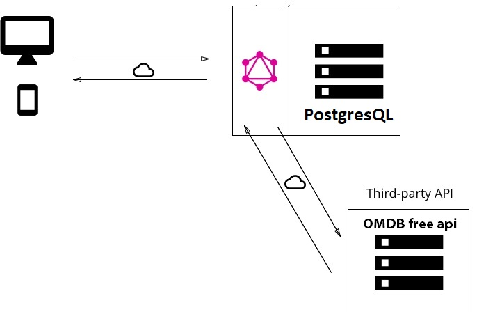

# Oscar-factory-graphql-api

<!-- TABLE OF CONTENTS -->

  
Table of Contents

  <ol>
    <li>
      <a href="#about-the-project">About The Project</a>
      <ul>
        <li><a href="#built-with">Built With</a></li>
      </ul>
    </li>
    <li>
      <a href="#getting-started">Getting Started</a>
      <ul>
        <li><a href="#prérequis">Prérequis</a></li>
        <li><a href="#création-de-la-bdd">Création de la BDD</a></li>
      </ul>
    </li>
    <li><a href="#lancement-de-lapi">Lancement de l'API</a></li>
    <li><a href="#documentation">Documentation</a></li>
    <li><a href="#contact">Contact</a></li>
  </ol>

## About The Project
:sparkles::sparkles::sparkles:

Projet personnel qui m'a permis d'intégrer les notions liées aux APIs GraphQL et à la gestion des performances de mes requêtes.

L'objectif de l'application sera de pouvoir rechercher et intégrer des données de films grâce à un outil de recherche. 
L'utilisateur non connecté pourra visualiser les films receuillis et voir les commentaires des utilisateurs enregistrés. 
Un utilisateur connecté pourra ajouter des films à la liste, les mettres en favoris et ajouter des commentaires aux films.

Cette API graphql consomme à la fois les données d'une BDD postgres mais également les données d'une api externe fournie par [The Open Movie Database](https://www.omdbapi.com/)

:point_down:

(<a href="#top">back to top</a>)

## Built With

* [Node JS](https://nodejs.org/en/)
* [Apollo GraphQL](https://www.apollographql.com/)
* [PostgreSQL](https://www.postgresql.org/)

## Getting Started
:sunglasses:
### Prérequis

1. Récupérer une API key gratuite depuis le site [OMDB](https://www.omdbapi.com/)
2. Avoir une base de donnée PostgresQL disponible et un utilisateur créé.
3. Cloner le repository, utiliser le .env.example afin de renseigner vos credentials
4. Installer les dépendances à l'aide du gestionnaire de package NPM

(<a href="#top">back to top</a>)

### Création de la BDD

Si vous avez configuré un utilisateur par défaut vous pouvez utiliser `npm run initDB`.

Sinon créez votre BDD avec le nom `oscar-factory-db` et lancez le script `npm run resetDB`. 
(attention, ce script est adapté pour un OS windows, il doit être légèrement réajusté pour un autre OS comme linux) 
Vous pouvez voir un example ici :point_right: [script-linux](script-linux.md)

Si votre environnement ne vous permet pas d'exécuter la commande, passez en utilisateur `postgres` grâce à la commande `sudo -i -u postgres`

(<a href="#top">back to top</a>)

## Lancement de l'API

`npm run devDataloader`

## Documentation

RDV sur la page de bac à sable de Apollo de l'application web [Apollo Studio](https://studio.apollographql.com/sandbox/explorer)

(<a href="#top">back to top</a>)

## Contact

:speech_balloon: Thobena Yann - [@Mon porte-folio](https://thobena-yann-developpeur-web.netlify.app/) - mail: thobena.yann@gmail.com

<!-- Project Link: [https://github.com/github_username/repo_name](https://github.com/github_username/repo_name) -->

(<a href="#top">back to top</a>)

